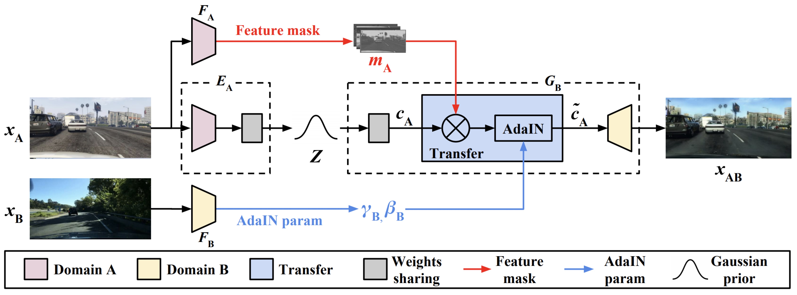

# Exemplar Guided Unsupervised Image-to-Image Translation with Semantic Consistency
Tensorflow implementation of ICLR 2019 paper [Exemplar Guided Unsupervised Image-to-Image Translation with Semantic Consistency](https://openreview.net/pdf?id=S1lTg3RqYQ)


## Network architecture


## Information flow diagrams


## Dependencies
- python 3.6.9
- tensorflow-gpu (1.14.0)
- numpy (1.14.0)
- Pillow (5.0.0)
- scikit-image (0.13.0)
- scipy (1.0.1)
- matplotlib (2.0.0)


## Resources
- Pretrained models: [MNIST](http://homes.esat.kuleuven.be/~liqianma/ICLR19_EGSCIT/models/mnist_models.zip), [MNIST_multi](http://homes.esat.kuleuven.be/~liqianma/ICLR19_EGSCIT/models/mnist_multi_models.zip), [GTA<->BDD](http://homes.esat.kuleuven.be/~liqianma/ICLR19_EGSCIT/models/gta_bdd_models.zip), [CelebA](http://homes.esat.kuleuven.be/~liqianma/ICLR19_EGSCIT/models/celeba_models.zip), [VGG19](http://homes.esat.kuleuven.be/~liqianma/ICLR19_EGSCIT/weights/vgg19.npy)
- Training & Testing data in tf-record format: [MNIST](http://homes.esat.kuleuven.be/~liqianma/ICLR19_EGSCIT/data/mnist_tf.zip), [MNIST_multi](http://homes.esat.kuleuven.be/~liqianma/ICLR19_EGSCIT/data/mnist_multi_tf.zip). [GTA<->BDD](http://homes.esat.kuleuven.be/~liqianma/ICLR19_EGSCIT/data/gta_bdd_tf.zip), [CelebA](http://homes.esat.kuleuven.be/~liqianma/ICLR19_EGSCIT/data/celeba_tf.zip).
Note: For the GTA<->BDD experiment, the data are prepared with RGB images of 512x1024 resolution, and segmentation labels of 8 categories. They are provided used for further research. In our paper, we use RGB images of 256x512 resolution without and segmentation labels.
- Segmentation model
Refer to [DeepLab-ResNet-TensorFlow](https://github.com/DrSleep/tensorflow-deeplab-resnet)

## TF-record data preparation steps (Optional)
You can skip this data preparation procedure if directly using the tf-record data files.
1. `cd datasets`
2. `./run_convert_mnist.sh` to download and convert mnist and mnist_multi to tf-record format.
3. `./run_convert_gta_bdd.sh` to convert the images and segmentation to tf-record format. You need to download data from [GTA5 website](https://download.visinf.tu-darmstadt.de/data/from_games/) and [BDD website](http://bdd-data.berkeley.edu/). Note: this script will reuse gta data downloaded and processed in `./run_convert_gta_bdd.sh`
4. `./run_convert_celeba.sh` to convert the images to tf-record format. You can directly download the prepared data or download and process data from [CelebA website](http://mmlab.ie.cuhk.edu.hk/projects/CelebA.html) .

## Training steps
1. Replace the links `data`, `logs`, `weights` with your own directories or links.
2. Download [VGG19](http://homes.esat.kuleuven.be/~liqianma/ICLR19_EGSCIT/weights/vgg19.npy) into 'weights' directory.
3. Download the tf-record training data to the `data_parent_dir` (default `./data`).
4. Modify the `data_parent_dir`, `checkpoint_dir` and comment/uncomment the target experiment in the `run_train_feaMask.sh` and `run_train_EGSCIT.sh` scripts.
5. Run `run_train_feaMask.sh` to pretrain the feature mask network. Then run `run_train_EGSCIT.sh`.
 
## Testing steps
1. Replace the links `data`, `logs`, `weights` with your own directories or links.
2. (Optional) Download the pretrained models to the `checkpoint_dir` (default `./logs`).
3. Download the tf-record testing data to the `data_parent_dir` (default `./data`).
4. Modify the `data_parent_dir`, `checkpoint_dir` and comment/uncomment the target experiment in the `run_test_EGSCIT.sh` script.
5. run `run_test_EGSCIT.sh`. 

## Citation
```
@article{ma2018exemplar,
  title={Exemplar Guided Unsupervised Image-to-Image Translation with Semantic Consistency},
  author={Ma, Liqian and Jia, Xu and Georgoulis, Stamatios and Tuytelaars, Tinne and Van Gool, Luc},
  journal={ICLR},
  year={2019}
}
```

## Related projects
- [UNIT-Tensorflow](https://github.com/taki0112/UNIT-Tensorflow)
- [SG-GAN](https://github.com/Peilun-Li/SG-GAN)
- [Pose-Guided-Person-Image-Generation](https://github.com/charliememory/Pose-Guided-Person-Image-Generation)
